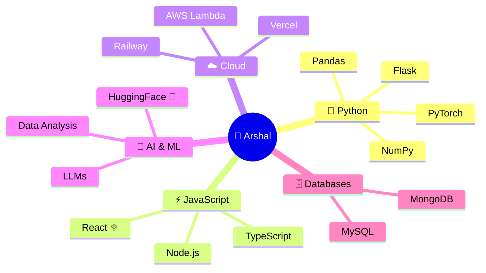
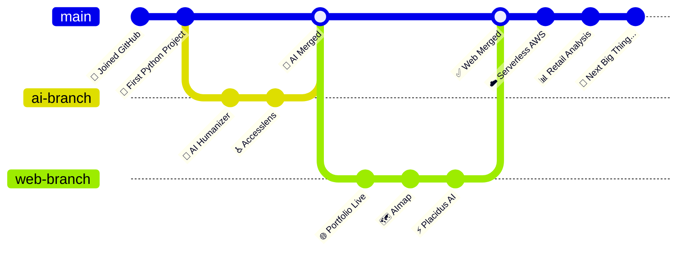

<div align="center">

<!-- ═══ ANIMATED HEADER BANNER ═══ -->


<br/>

<!-- ═══ TYPING ANIMATION ═══ -->


<br/><br/>

<!-- ═══ BADGES ROW ═══ -->
<a href="https://github.com/MeowMan007">
  
</a>
&nbsp;

&nbsp;

&nbsp;


</div>

---

## ⚔️ Developer RPG Stats — Arshal `[LVL 99]`

```
╔══════════════════════════════════════════════════════════════╗
║           🧙 MEOWMAN007 — ARCANE CODE MAGE                  ║
║                    ★ ★ ★ ★ ★                                ║
╠══════════════════════════════════════════════════════════════╣
║  CLASS    :  Full-Stack Sorcerer + AI Alchemist              ║
║  ORIGIN   :  The Internet  🌐                                ║
║  GUILD    :  GitHub  [ MeowMan007 ]                          ║
║  STATUS   :  ⚡ ONLINE & BUILDING                            ║
╠══════════════════════════════════════════════════════════════╣
║                                                              ║
║  ❤️  HP      ████████████████████░░░░  90 / 100             ║
║  💙  MANA    ███████████████████░░░░░  85 / 100  (coffee ☕) ║
║  ⚡  SPEED   ██████████████████░░░░░░  80 / 100  (fast ship) ║
║  🛡️  FOCUS   █████████████████████░░  95 / 100             ║
║                                                              ║
╠══════════════════════════════════════════════════════════════╣
║  SKILLS UNLOCKED                                             ║
║                                                              ║
║  🐍 Python       ████████████████████  ★★★★★  MASTERED     ║
║  ⚡ JavaScript   ████████████████████  ★★★★★  MASTERED     ║
║  💙 TypeScript   █████████████████░░░  ★★★★☆  EXPERT       ║
║  ⚛️  React        ████████████████░░░░  ★★★★☆  EXPERT       ║
║  ☁️  AWS          ██████████████░░░░░░  ★★★☆☆  ADVANCED     ║
║  🤖 AI / ML      █████████████░░░░░░░  ★★★☆☆  ADVANCED     ║
║  📊 Data Sci     ████████████░░░░░░░░  ★★★☆☆  ADVANCED     ║
╠══════════════════════════════════════════════════════════════╣
║  ACHIEVEMENTS                                                ║
║  🏅 25+ Repos Deployed    🏅 6 Live Apps Built               ║
║  🏅 AI Tools Creator      🏅 Cloud Architect                 ║
╚══════════════════════════════════════════════════════════════╝
```

---

## 🗺️ Tech Skill Tree



---

## 📜 Active Quest Log

```
┌─────────────────────────────────────────────────────────────┐
│                    📋 QUEST LOG                             │
├──────┬──────────────────────────────────────┬───────────────┤
│  ⚔️  │ Build Placidus AI                    │  ✅ DEPLOYED  │
│  ⚔️  │ Launch Portfolio Site                │  ✅ LIVE      │
│  ⚔️  │ Create AImap Explorer                │  ✅ LIVE      │
│  ⚔️  │ Ship Accesslens on HuggingFace       │  ✅ COMPLETE  │
│  ⚔️  │ Deploy Serverless App on AWS         │  ✅ COMPLETE  │
│  🔮  │ Master Advanced AI/ML Techniques     │  🔄 IN PROG  │
│  🔮  │ Build next big AI product            │  🔄 IN PROG  │
│  🗡️  │ Contribute to Open Source            │  🔜 UPCOMING │
└──────┴──────────────────────────────────────┴───────────────┘
```

---

## 🛠️ Tech Stack & Skills

<div align="center">

### 💻 Languages


### ⚡ Frameworks & Libraries


### ☁️ Cloud & DevOps


### 🗄️ Databases & Tools


</div>

---

## ⚡ GitHub Stats

<div align="center">


<br/>


</div>

---

## 🌟 Featured Projects

<div align="center">

| 🚀 Project | 🛠️ Stack | 🌐 Live |
|:---:|:---:|:---:|
| 🤖 **[Placidus AI](https://github.com/MeowMan007/Placidus_ai)** | `JavaScript` | [](https://placidus-ai.vercel.app/) |
| 🌐 **[Portfolio](https://github.com/MeowMan007/portfolio)** | `TypeScript` | [](https://arshals.vercel.app/) |
| 🗺️ **[AImap](https://github.com/MeowMan007/AImap)** | `HTML` | [](https://a-imap.vercel.app) |
| ♿ **[Accesslens](https://github.com/MeowMan007/Accesslens)** | `Python` | [](https://huggingface.co/spaces/Arshal7xy/AccessAudit) |
| ☁️ **[Serverless AWS](https://github.com/MeowMan007/serverless-webapp-aws)** | `AWS` | [](https://github.com/MeowMan007/serverless-webapp-aws) |
| 📊 **[Retail Analysis](https://github.com/MeowMan007/retail-sales-data-analysis)** | `Python` | [](https://github.com/MeowMan007/retail-sales-data-analysis) |

</div>

---

## 🏆 Achievements Unlocked

```
  🥇 Consistent Builder     — 25+ repos on GitHub
  🥇 Deployer               — 6+ live apps in production
  🥇 AI Crafter             — Built & deployed AI tools
  🥇 Cloud Rider            — Serverless app on AWS
  🥇 Full-Stack Warrior     — Frontend + Backend + DB
  🥇 Data Wizard            — Python data analysis pipelines
  🔒 10 Stars               — Keep building! (in progress...)
  🔒 Open Source Hero       — Coming soon...
```

---

## 📊 Contribution Map



---

## 🐍 Contribution Snake

<div align="center">
<picture>
  <source media="(prefers-color-scheme: dark)" srcset="https://raw.githubusercontent.com/MeowMan007/MeowMan007/output/github-contribution-grid-snake-dark.svg"/>
  <source media="(prefers-color-scheme: light)" srcset="https://raw.githubusercontent.com/MewMan007/MeowMan007/output/github-contribution-grid-snake.svg"/>
  
</picture>
</div>

---

<div align="center">

```
██████╗  ██╗   ██╗██╗██╗     ██████╗     ███████╗
██╔══██╗ ██║   ██║██║██║     ██╔══██╗    ██╔════╝
██████╔╝ ██║   ██║██║██║     ██║  ██║    ███████╗
██╔══██╗ ██║   ██║██║██║     ██║  ██║    ╚════██║
██████╔╝ ╚██████╔╝██║███████╗██████╔╝    ███████║
╚═════╝   ╚═════╝ ╚═╝╚══════╝╚═════╝     ╚══════╝
```

### 🤝 Let's connect and build something epic!

[](https://github.com/MeowMan007)
&nbsp;
[](https://arshals.vercel.app/)
&nbsp;
[](https://placidus-ai.vercel.app/)

<br/>

> *"Every line of code is a spell. Keep casting. 🧙‍♂️"*


</div>
